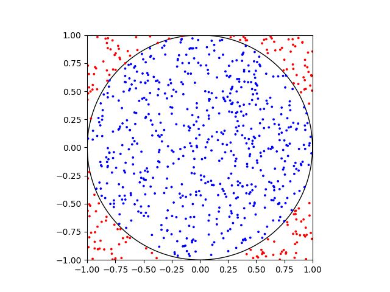

<!--

-->
# **A Random Sample of Some Interesting Random Number Generating Algorithms in the rand Crate**

by Greg

for Deep Dish Discourse

---
<style>
img[alt~="center"] {
  display: block;
  margin: 0 auto;
}
</style>


- Anti-aliasing demo from Ray Tracing in a Weekend
<!--
Test. [^1]

[^1]: footnote
-->


---


---

# Randomizing a ray from the camera

```rust
 let pixel_sample: Vec3 = pixel_center + self.pixel_sample_square();
```

```rust
    fn pixel_sample_square(&self) -> Vec3 {
        let px = -0.5 + random_float_zero_to_one();
        let py = -0.5 + random_float_zero_to_one();
        (px * self.pixel_delta_u) + (py * self.pixel_delta_v)
    }
```

---

# But what if it wasn't square?

---

## But what if it wasn't square?

## What if it was a something else like a circle?

---

## But what if it wasn't square?

## What if it was a something else like a circle?

It actually didn't end up mattering


---

# Rust Rand Crate

https://github.com/rust-random/

rand/rand_distr/src/unit_disc.rs

```rust
impl<F: Float + SampleUniform> Distribution<[F; 2]> for UnitDisc {
  fn sample<R: Rng + ?Sized>(&self, rng: &mut R) -> [F; 2] {
        // Spoilers, we'll come back here
    }
}

```

---

# Let's design a random circle point picking algorithm

---

# Let's design a random circle point picking algorithm

- Selects an ${(x,y)}$ in  ${\rm I\!R^2}$ that satisfies ${\sqrt{x^2+y^2} < 1}$

---

# Let's design a random circle point picking algorithm

- Selects an ${(x,y)}$ in  ${\rm I\!R^2}$ that satisfies ${\sqrt{x^2+y^2} < 1}$
- Uniformly distributed throughout the disc
- Ideally fast
  - Minimizes RNG calls
  - Avoids calculation pitfalls
  - Space / Time tradeoffs considered for more complicated algorithms

---

# First attempt:

```rust
use rand::{thread_rng, Rng};

pub fn random_uniform() -> f32 {
    let mut rng = thread_rng();
    rng.gen() // Gives a float [0.0 ,1.0)
}
```

---


$$
float = (-1)^{b_{sign}} \times 2^{E-127} \times 1.b_{22}b_{23}...b_{0}
$$

$$
mantissa = 1.0100...
$$

Source: https://en.wikipedia.org/wiki/Single-precision_floating-point_format

---

#  First attempt

```rust
fn sample_unit_disc_point() -> (f32, f32) {
  let angle = (random_uniform() * 2. - 1.) * f32.PI;
  let r = random_uniform();
  let x = r * angle.cos();
  let y = r * angle.sin();
  (x,y)
}
```
* 2 RNG calls 🅱️
* Math stuff? ${sin}$ and ${cos}$ system dependent performance
* Satisfies ${\sqrt{x^2+y^2} < 1}$ 🐻


---

# First attempt


---

# First attempt


---

# First attempt (Not so uniform 😔)


---

# Second attempt

```rust
fn sample_unit_disc_point() -> (f32, f32) {
  let mut x;
  let mut y;
  loop {
    x = random_uniform() * 2. - 1.
    y = random_uniform() * 2. - 1.
    if (x*x + y*y <= 1.) {
      return (x, y) // Accept
    } // Reject
  }
}
```
---

# Second attempt



---

# Second attempt

* Uniform 🤓
* Fast? 🤔

---

# Second attempt: Rejection Algorithm

* Uniform 🤓
* Fast? 🤔
  * Avoids evil math 😈
  * Probability of generating an accepted per iteration ${p = \frac{\pi r^2}{2^2} \approx 78 \%}$
  * Number of additionals iterations required is a Geometric distribution
  * Expected value of ~1.3 iterations to find a value

---

# Rust Rand Crate: Unit Disc

```rust
impl<F: Float + SampleUniform> Distribution<[F; 2]> for UnitDisc {
  fn sample<R: Rng + ?Sized>(&self, rng: &mut R) -> [F; 2] {
        let uniform = Uniform::new(F::from(-1.).unwrap(), F::from(1.).unwrap()).unwrap();
        let mut x1;
        let mut x2;
        loop {
            x1 = uniform.sample(rng);
            x2 = uniform.sample(rng);
            if x1 * x1 + x2 * x2 <= F::from(1.).unwrap() {
                break;
            }
        }
        [x1, x2]
    }
}


```

---

# Rust Rand Crate: Unit Ball

```rust
impl<F: Float + SampleUniform> Distribution<[F; 2]> for UnitDisc {
  fn sample<R: Rng + ?Sized>(&self, rng: &mut R) -> [F; 2] {
        let uniform = Uniform::new(F::from(-1.).unwrap(), F::from(1.).unwrap()).unwrap();
        let mut x1;
        let mut x2;
        let mut x3;
        loop {
            x1 = uniform.sample(rng);
            x2 = uniform.sample(rng);
            x3 = uniform.sample(rng);
            if x1 * x1 + x2 * x2 + x3 * x3 <= F::from(1.).unwrap() {
                break;
            }
        }
        [x1, x2, x3]
    }
}
```

---

# Let's Not Design a Normal Distribution Sampling Algorithm


${f(x) = \frac{1}{\sigma\sqrt{2\pi}}\exp\left(-\frac{1}{2}\left(\frac{x-\mu}{\sigma}\right)^{2}\right)}$

${f(x) = \exp(-\frac{x^2}{2})}$

---

# Ziggurat Method


---

# Ziggurat Method

0) $C$ is a specially selected number of boxes. Precompute $x_i$ and the respective $y_i =f(x_i)$ values such that the volumes $V$ of all $C$ boxes are equal. $B_0$ is special in that its volume $V$ includes the tail.
1) Uniformly select any index, box pair $i$ and $B_i$.
2) With uniform ${U \in [0,1)}$, get candidate along base of box ${z=U_0x_i}$
3) If ${z < x_{i+1}}$, accept and return candidate $z$.
4) Else rejection test
  a) If ${i=0}$ (lowest base box selected), get a tail value*
  b) If ${i\ne0}$, compare ${h=U_1[height(B_i)]}$ and ${f(z)}$. Accept if less else goto 1


---

# Ziggurat Method: Example


---

# Ziggurat Method: signature
```rust
#[inline(always)]
pub(crate) fn ziggurat<R: Rng + ?Sized, P, Z>(
    rng: &mut R,
    symmetric: bool,
    x_tab: ziggurat_tables::ZigTable,
    f_tab: ziggurat_tables::ZigTable,
    mut pdf: P,
    mut zero_case: Z,
) -> f64
where
    P: FnMut(f64) -> f64,
    Z: FnMut(&mut R, f64) -> f64,
{
```

---

# Ziggurat Method: implementation
```rust
loop {
        let bits = rng.next_u64();
        let i = bits as usize & 0xff; // REALLY COOL OPTIMIZATION
        let u = (bits >> 12).into_float_with_exponent(0) - (1.0 - f64::EPSILON / 2.0)
        let x = u * x_tab[i];
        let test_x = x

        if test_x < x_tab[i + 1] {
            return x;
        }
        if i == 0 {
            return zero_case(rng, u);
        }
        if f_tab[i + 1] + (f_tab[i] - f_tab[i + 1]) * rng.random::<f64>() < pdf(x) {
            return x;
        }
    }

```

---


$$
float = (-1)^{b_{sign}} \times 2^{E-127} \times 1.b_{22}b_{23}...b_{0}
$$

$$
mantissa = 1.0100...
$$

Source: https://en.wikipedia.org/wiki/Single-precision_floating-point_format

---

# Ziggurat Method: Zero Case
```rust
fn zero_case<R: Rng + ?Sized>(rng: &mut R, u: f64) -> f64 {
            let mut x = 1.0f64;
            let mut y = 0.0f64;

            while -2.0 * y < x * x {
                let x_: f64 = rng.sample(Open01);
                let y_: f64 = rng.sample(Open01);

                x = x_.ln() / ziggurat_tables::ZIG_NORM_R;
                y = y_.ln();
            }

            if u < 0.0 {
                x - ziggurat_tables::ZIG_NORM_R
            } else {
                ziggurat_tables::ZIG_NORM_R - x
            }
        }

```

---

# Further Readings And Sources

* Wikipedia
  * Single and double precision floating point
  * Uniform distribution
  * N-ball
  * Normal distribution
* https://github.com/rust-random/rand
  * Code comments heavily cite papers and research

---

# Further Readings And Sources

* Marsaglia and Tsang
* Chacha and salsa, Mersenne twisters, rngs and entropy
* Normal sampling
  * An Improved Ziggurat Method to Generate Normal
Random Samples
    * https://www.doornik.com/research/ziggurat.pdf
  * Generating a Variable from the Tail
of the Normal Distribution
    * https://apps.dtic.mil/sti/tr/pdf/AD0423993.pdf
