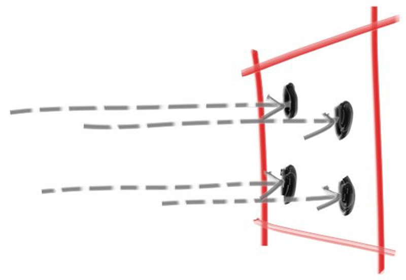

<!--

-->
# **A Random Sample of Some Interesting Random Number Generating Algorithms in the rand Crate**

by Greg

for Deep Dish Discourse

---
<style>
img[alt~="center"] {
  display: block;
  margin: 0 auto;
}
</style>


- Anti-aliasing demo from Ray Tracing in a Weekend
<!--
Test. [^1]

[^1]: footnote
-->


---



---

# Randomizing a ray from the camera

```rust
 let pixel_sample: Vec3 = pixel_center + self.pixel_sample_square();
```

```rust
    fn pixel_sample_square(&self) -> Vec3 {
        let px = -0.5 + random_float_zero_to_one();
        let py = -0.5 + random_float_zero_to_one();
        (px * self.pixel_delta_u) + (py * self.pixel_delta_v)
    }
```

---

# But what if it wasn't square?

---

## But what if it wasn't square?

## What if it was a something else like a circle?

---

## But what if it wasn't square?

## What if it was a something else like a circle?

It actually didn't end up mattering


---

# Rust Rand Crate

https://github.com/rust-random/

rand/rand_distr/src/unit_disc.rs

```rust
impl<F: Float + SampleUniform> Distribution<[F; 2]> for UnitDisc {
  fn sample<R: Rng + ?Sized>(&self, rng: &mut R) -> [F; 2] {
        // Spoilers, we'll come back here
    }
}

```

---

# Let's design a random circle point picking algorithm

---

# Let's design a random circle point picking algorithm

- Selects an ${x,y}$ in  ${\rm I\!R_2}$
- Satisfies ${\sqrt{x^2+y^2} < 1}$

---

# Let's design a random circle point picking algorithm

- Selects an ${x,y}$ in  ${\rm I\!R_2}$
- Satisfies ${\sqrt{x^2+y^2} < 1}$
- Uniformly distributed
- Fast
  - Minimizes RNG calls
  - Space / Time tradeoffs considered 

---

# How to write slides

Split pages by horizontal ruler (`---`). It's very simple! :satisfied:

```markdown
# Slide 1

foobar

---

# Slide 2

foobar
```

---

# Slide 3

new slide

* this is how to do a bullet point